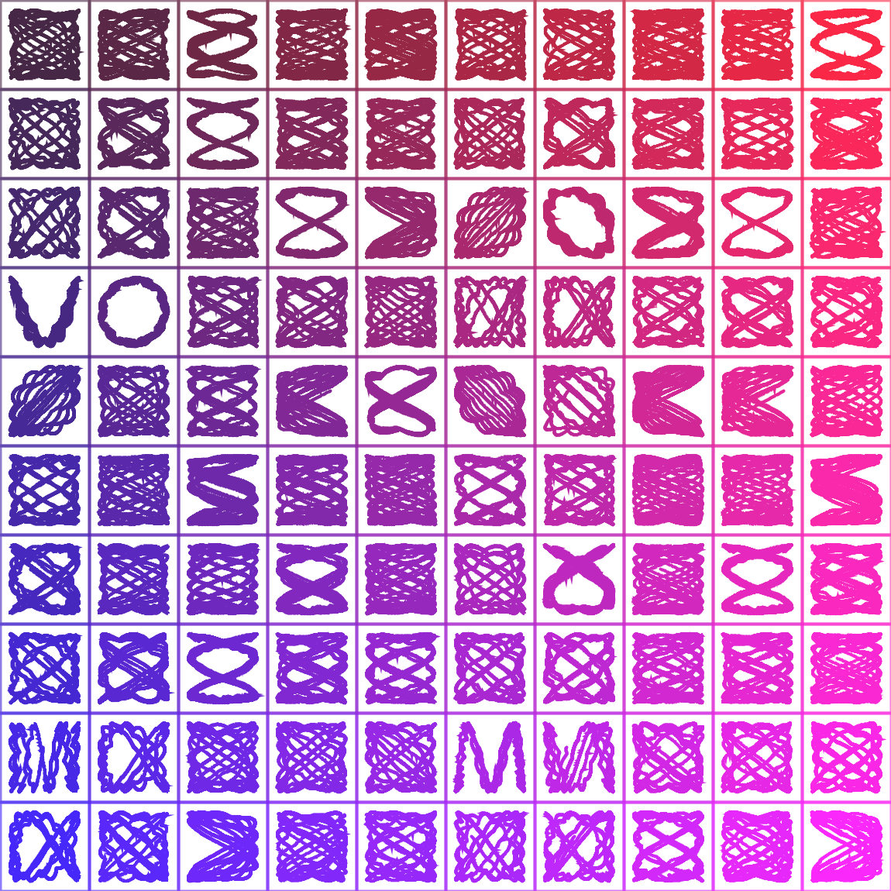
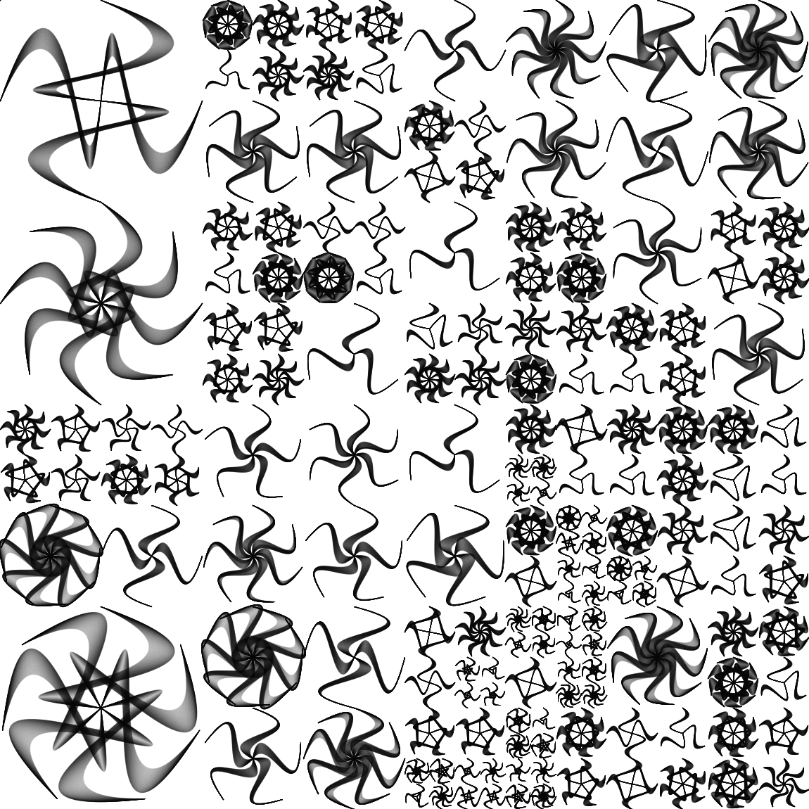
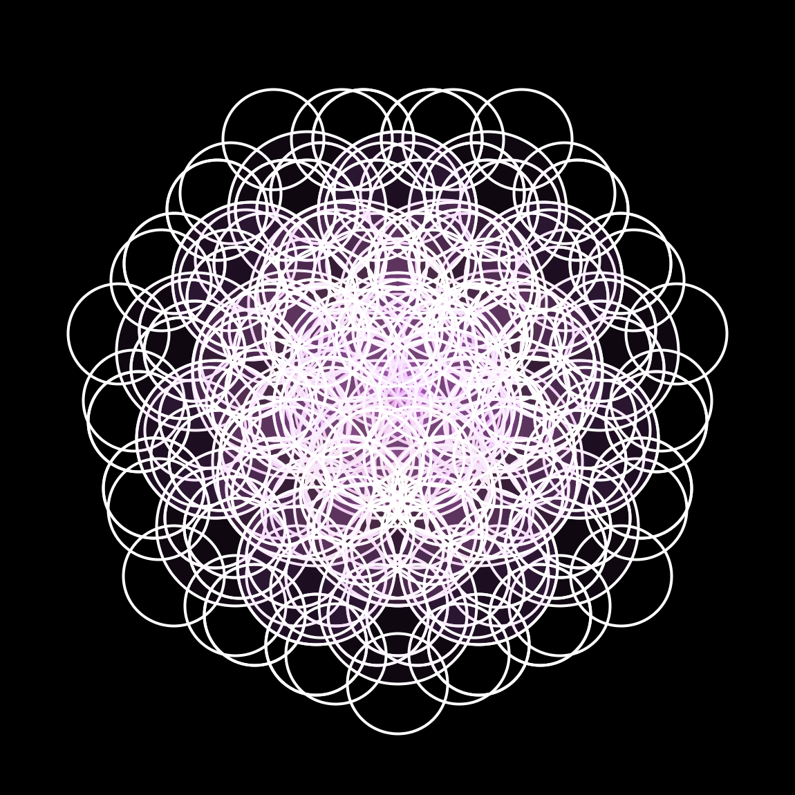
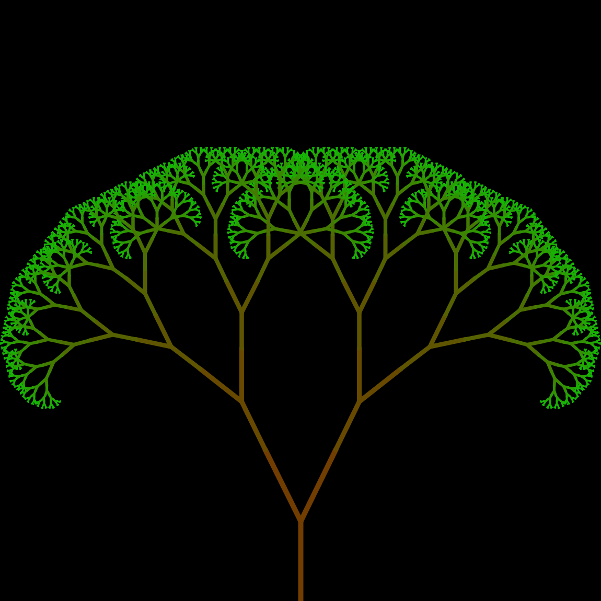

# art_ificial
:paintbrush: My explorations on generative art!

Here are some of the Processing sketches in this repo, with a comment on what I was trying to achieve and some technical details of the implementation.

- *arc_structures*

    Using a grid of randomly generated [Lissajous curve](https://en.wikipedia.org/wiki/Lissajous_curve) with an RGB gradient;
    
 

- *flower_bezier*

    Uses a grid of Bezier-based geometric shapes, the patterns are added using a recursive random division of the grid into smaller parts;
    
 

- *flower_of_life*

    Implementation of Sacred Geometry's [Flower of Life](https://en.wikipedia.org/wiki/Overlapping_circles_grid#Modern_usage) pattern. This sketch is interactive and the position of the mouse changes the geometrical shape; [GIF HERE](https://i.imgur.com/mmLGusw.gif).
    
 

- *fractal_tree*

    Simple fractal tree implementation; [GIF HERE](https://i.imgur.com/VoXciUz.gif).
    
 

- *spiral*
    
    Simple spiral using circles moving alongside a Spiral parametrized in Polar Equations; [GIF HERE](https://i.imgur.com/k9OoRPO.gif).

- *squares_linked*

    Moving Squares, where each new square can randomly generate a "child" and so on. Each square is linked to its father, and move alongside the screen;

---

[Misc. Reference for Processing](docs/misc.md)

TODO:

- Parametric functions

- Recurrence relations